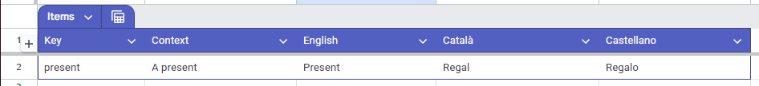
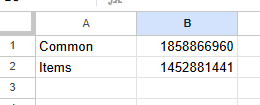
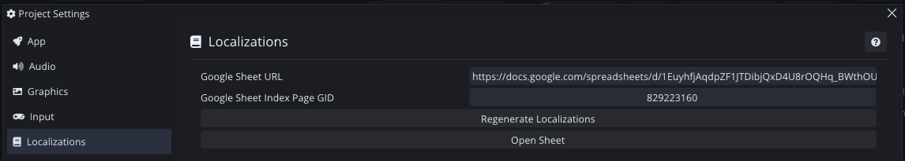
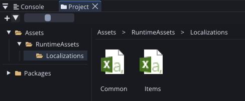
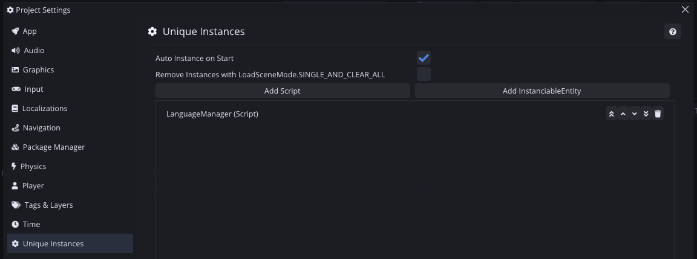
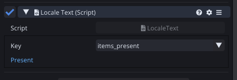
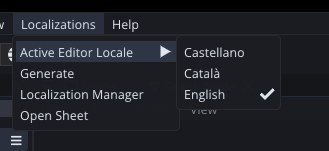
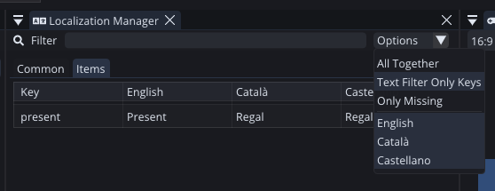

# Comet Engine Localizations Package

Simplify your game's translation workflow with the **Comet Engine Localizations Package**. This tool allows you to manage all your localization data directly from Google Sheets and seamlessly integrate it into your Comet project.

  
  
  

---

## 🚀 Quick Start Tutorial

Follow these steps to set up the localization system in your project.

### 1. Set up your Google Sheet
Create a new Google Sheet. The first tab **must** be named `Index`. This tab acts as a manifest, listing all other sheets that should be imported.

For your translation tabs:
*   **Column 1:** The translation **Key**.
*   **Column 2:** **Context** (notes on where the text is used).
*   **Subsequent Columns:** One column for each **Language** you support.
*   *Note: Ensure the language order is identical across all tabs.*

### 2. Identify Sheet GIDs
Each tab in a Google Sheet has a unique ID called a **GID**, found at the end of the URL (e.g., `gid=829223160`). 
In your `Index` tab, list the name of each tab you want to import and its corresponding GID.

### 3. Configure Comet Editor
Open the Comet Editor and navigate to **Project Settings > Localizations**.
*   Paste your **Google Sheet URL** (ensure "Anyone with the link" has at least viewer access).
*   Enter the **GID** of your `Index` tab.

### 4. Fetch Translations
To download your data, click **Regenerate Localizations** in the Project Settings or go to **Localizations > Generate** in the main menu bar. 

Once triggered, the system will download each tab as a `.csv` file into the `Assets/RuntimeAssets/Localizations` directory. Perform this action whenever you update your Google Sheet.

### 5. Initialize the Manager
Go to **Project Settings > Unique Instances**, click **Add Script**, and select the `LanguageManager`. This ensures the localization system is ready when your project runs.

### 6. Localizing UI Text
To localize UI elements, add the `LocaleText` behaviour to your text entities. Use this behaviour to assign the translation key; the text will automatically update to reflect the active language.

---

## 💻 Scripting API

You can easily interact with the localization system via code using the following methods:

| Property / Method | Description |
| :--- | :--- |
| `Language::get.currentLanguage` | Returns the currently active language. |
| `Language::get.availableLanguages` | Returns a list of all imported languages. |
| `Language::get.Load(string language)` | Switches the project's language at runtime. |
| `Language::get.GetLocalization(string key)` | Returns the translated value for a specific key in the current language. |

---

## ✨ Extra Features

### Main Menu Bar
The **Localizations** menu provides quick access to essential tools:
*   **Language Preview:** Switch languages in the editor to see UI changes instantly.
*   **Regenerate:** Quickly update all local localization files.
*   **Localization Manager:** Open the dedicated table view.
*   **Remote Source:** Quickly open the linked Google Sheet.

### Localization Manager
A dedicated window to browse and manage your translations inside the editor. It includes:
*   **Filtering:** Filter by specific languages or tabs.
*   **Search:** Search for specific keys or values.
*   **Validation:** Quickly identify missing translations (empty values).

